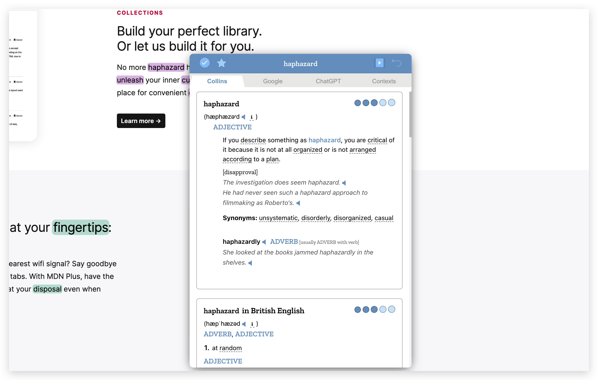

    
   
   <h3 align="center">Word hunter</h3>
   
Discover new english <mark>words</mark> you don't know on any web page

## Installation

[Chrome Web Store](https://chrome.google.com/webstore/detail/word-hunter/nigkedajkofkhoedhgiipmigiebldaem)

## How it works

At first, all the words on the web page are "unknown" by default. You can hover over the words and mark them as "known", and the words will no longer be highlighted.

After you mark as many words as possible for "known", the words highlighted are those you really don't know, you can find them at a glance.

## How to Skip basic words

You can change which levels of words to be highlighted in settings.

let's say you want to skip the level below CET-6.

## How to mark faster

1. Click the icon of extension on the toolbar, then click "toggle zen mode" button in the pop-up panel.
2. Exclude the words you really don't know by <kbd>⌘</kbd>(or <kbd>win</kbd>) + <kbd>Click</kbd> on the words.
3. Click "set all words as known" button

This will make all "unknown" words as "known", except the words you excluded in step 2.

## Keyboard shortcuts

- <kbd>Tab</kbd> switch dict tab
- <kbd>→</kbd> switch dict tab right
- <kbd>←</kbd> switch dict tab left
- <kbd>↓</kbd> scroll down dict section
- <kbd>↑</kbd> scroll up dict section
- <kbd>ESC</kbd> close dict panel / close zen mode
