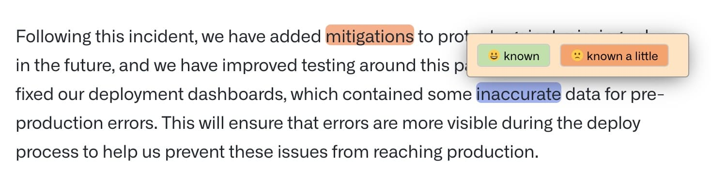
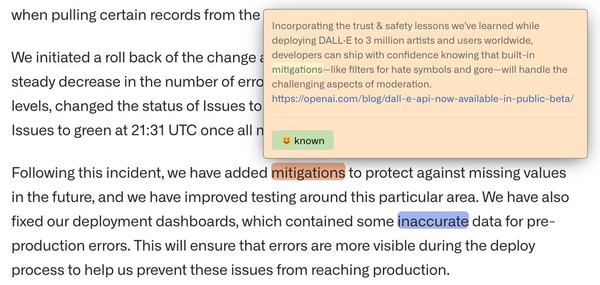
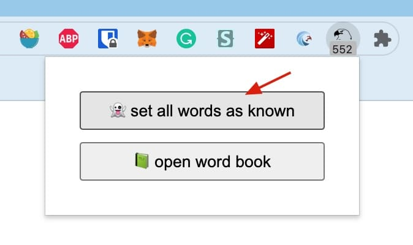

    
   
   <h3 align="center">Word hunter</h3>
   
Discover new english <mark>words</mark> you don't know on any web page

## How to use

There are three types of words on the web page, **unknown**, **known**, and **known a litte**,
"unknown" and "known a litte" will be highlighted.

<pre>
   ┌────────► known a little ──────┐
   │                               │
   │                               ▼
unknown ────────────────────────► known
</pre>

At first, all the words on the web page are "unknown" by default. You can hover over the words and mark them as "known", and the words will no longer be highlighted.

You can also mark it as "known a little". The next time you encounter the same word, it will be highlighted. hover the mouse over the word and the context you marked last time will be displayed.

After you mark as many words as possible for "known", the words highlighted are those you really don't know, you can find them at a glance.

## How to mark faster

- Mark the really not too familiar words on the page as "known a little"
- Click the icon of extension on the toolbar, then click "set all words as known" button in the pop-up panel.

This will mark all the "unknown" words on the page as "known", excluding the "known a litte" words.
